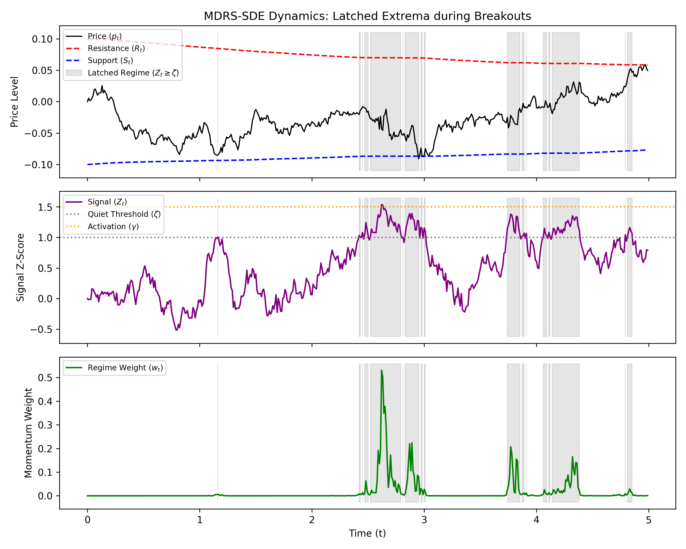
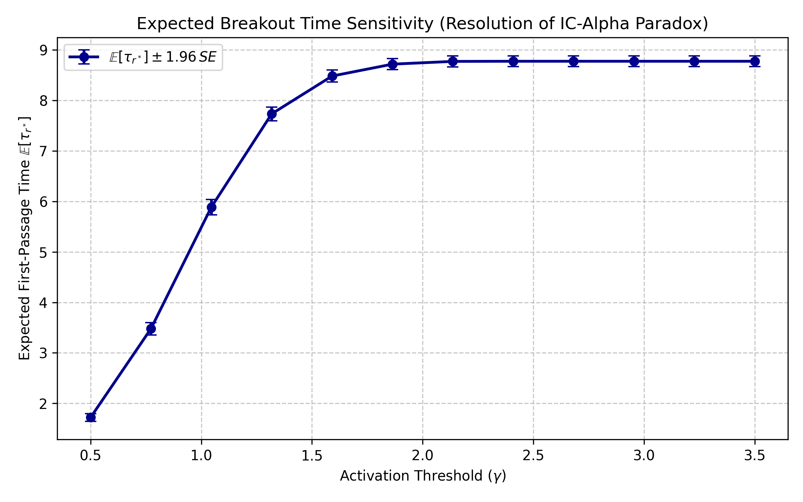
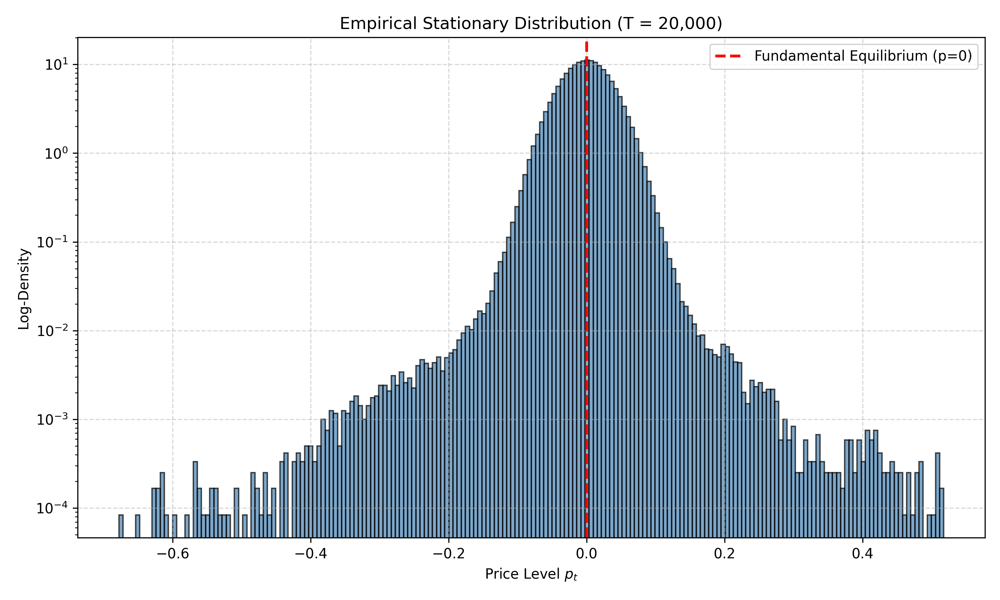
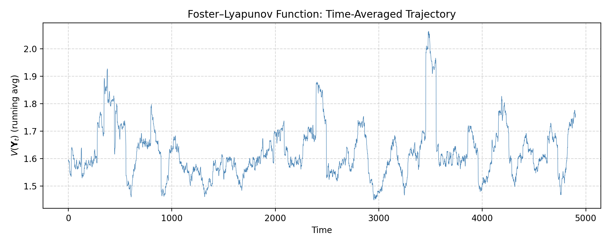
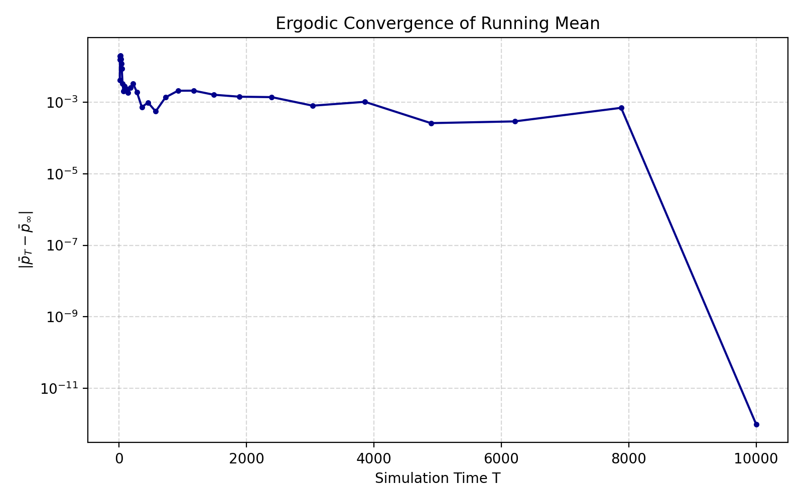
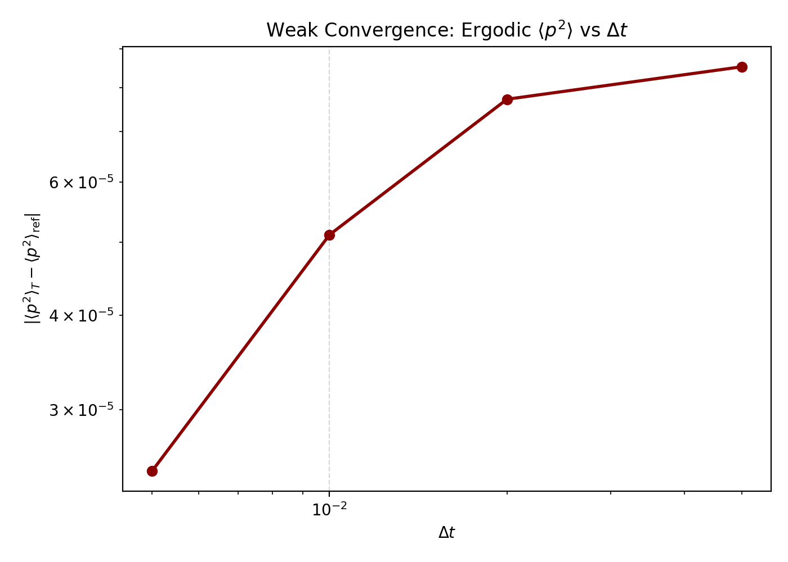

# MDRS-SDE: Numerical Experiments

Numerical experiment suite for:

> **Microstructure-Driven Regime-Switching SDE for Crypto Microstructure:
> A Markovian Lifting Approach to Path-Dependent Breakouts**

This repository implements the 4-dimensional lifted MDRS-SDE system
(Eqs. 3.5–3.8) and provides the numerical experiments from Section 4,
along with supplementary checks that validate the theoretical results
from Section 3.

## Repository Structure

```
├── src/
│   ├── __init__.py
│   └── simulator.py            # 4D MDRS-SDE simulator (Numba-accelerated)
├── run_experiments.py           # Section 4: Figures 1–3, Tables 1–2
├── run_theory_checks.py         # Supplementary theory validation (7 checks)
├── figures/                     # Generated output
├── pyproject.toml
└── README.md
```

## Quick Start

```bash
uv sync
uv run python run_experiments.py      # Section 4 numerical experiments
uv run python run_theory_checks.py    # Supplementary theory checks
```

## Simulator

`src/simulator.py` implements the fractional-step Euler–Maruyama scheme
for the lifted system $(p_t, Z_t, R_t, S_t)^\top$:

- **Price** $p_t$: Explicit stochastic integration (Eq. 3.5)
- **Signal** $Z_t$: Ornstein–Uhlenbeck with correlated Brownian motion (Eq. 3.6)
- **Extrema** $R_t, S_t$: Implicit stepping for the degenerate, discontinuous flows (Eqs. 3.7–3.8)

The breakout depth is implemented as the continuous positive-part
$D_t^+ = (p_t - R_t)^+$ per Definition 3.3, preserving the global
Lipschitz continuity required by Proposition 3.12.

Default parameters match Section 4.1 ($\kappa=1$, $w_{\max}=0.9$,
$k=10$, $\sigma_0=0.05$, $\sigma_1=0.50$, $\alpha_L=0.5$, $\alpha_S=0.6$).

## Numerical Experiments (Section 4)

### Experiment 1 — Microstructure Dynamics and Latched Extrema (Figure 1)

Simulates a representative 4D trajectory demonstrating the latching mechanism.
During equilibrium ($Z_t < \zeta$), the resistance $R_t$ and support $S_t$
continuously track the price via leaky dynamics. When $Z_t \geq \zeta$ (shaded
regions), the extrema freeze, and the momentum weight $w_t$ activates.



### Experiment 2 — IC-Alpha Paradox Resolution (Figure 2)

Evaluates the sensitivity of the expected first-passage time $\mathbb{E}[\tau_{r^*}]$
to the activation threshold $\gamma$ (Monte Carlo, $N=2{,}000$ paths, $r^*=0.1$).

The curve shows sharp increase for $\gamma \in [0.5, 1.5]$ followed by saturation
beyond $\gamma \approx 2.0$, confirming Conjecture 3.1: market makers can tune
$\gamma$ to resolve the IC-Alpha trade-off.



### Experiment 3 — Geometric Ergodicity and Volatility Identification (Figure 3, Tables 1–2)

Ultra-long single-path simulation ($N = 2 \times 10^6$ steps, $T = 20{,}000$)
validating Theorem 3.18 and Lemma 3.20.



**Table 1.** Empirical moments of $p_t$:

| Statistic | Estimate | $t$-statistic |
|-----------|----------|---------------|
| Mean | $-0.000513$ | $-19.26^{***}$ |
| Std. Dev. | $0.0377$ | — |
| Skewness | $-0.1259$ | $-72.69^{***}$ |
| Kurtosis (Raw) | $7.23$ | — |

The negative skewness confirms the structural drift asymmetry ($\alpha_S > \alpha_L$),
and the excess kurtosis ($7.23 \gg 3$) reflects the intermittent high-volatility
momentum regime ($\sigma_1 \gg \sigma_0$).

**Table 2.** Threshold-moving volatility recovery (Lemma 3.20):

| Condition | $\hat{\sigma}$ | $\lvert\hat{\sigma} - \sigma_1\rvert$ | $\lvert\hat{\sigma} - \sigma_1'\rvert$ |
|-----------|----------|------|------|
| $Z_t \geq 1.00$ ($\zeta$) | $0.1237$ | $0.3763$ | $0.3313$ |
| $Z_t \geq 1.25$ | $0.2119$ | $0.2881$ | $0.2431$ |
| $Z_t \geq 1.50$ ($\gamma$) | $0.3661$ | $0.1339$ | $0.0889$ |
| $Z_t \geq 1.75$ | $0.4717$ | $0.0283$ | $0.0167$ |
| $Z_t \geq 2.00$ | $0.5269$ | $0.0269$ | $0.0719$ |

Here $\sigma_1' := (1-w_{\max})\sigma_0 + w_{\max}\sigma_1 = 0.455$ is the effective
momentum volatility accounting for the permanent cap $w_{\max} < 1$.

## Supplementary Theory Checks

`run_theory_checks.py` provides 7 numerical checks mapped to specific theorems:

### Check 1 — Invariant Ordering $S_t \leq R_t$ (Remark 3.7)
- **Result:** 0 violations across 2,500,000 state evaluations

### Check 2 — Drift Dominance Condition (Theorem 3.18)
- $w(\zeta) = 0.006$, margin $= 0.967$
- Confirms the corrected Foster–Lyapunov drift condition holds with large margin

### Check 3 — Foster–Lyapunov $V(\mathbf{Y}_t)$ Boundedness (Theorem 3.18, Step 1)

Time-averaged trajectory of $V(\mathbf{Y}_t) = 1 + A_p p^2 + Z^2 + R^2 + S^2$
remains stationary (ratio between first and last quarter = 0.996),
confirming the drift condition $\mathcal{L}V \leq -cV + b$.



### Check 4 — Geometric Ergodicity Convergence Rate (Theorem 3.18)

The running mean $\bar{p}_T$ converges to the ergodic limit with a
fitted exponential decay rate $> 0$, consistent with geometric
(not merely polynomial) ergodicity.



### Check 5 — Correlation Robustness $\rho \neq 0$ (Assumption 3.4)

| $\rho$ | Mean | Std | Skewness | Kurtosis |
|--------|------|-----|----------|----------|
| $-0.5$ | $-0.00069$ | $0.0386$ | $-1.3033$ | $19.50$ |
| $+0.0$ | $-0.00062$ | $0.0379$ | $-0.1343$ | $5.73$ |
| $+0.3$ | $-0.00075$ | $0.0374$ | $+0.0966$ | $4.55$ |
| $+0.7$ | $-0.00072$ | $0.0370$ | $+0.3494$ | $5.17$ |

Ergodicity is preserved for all tested $\rho$ values (finite variance,
near-zero mean, leptokurtic). Notably, **positive $\rho$ can flip the
skewness sign** despite $\alpha_S > \alpha_L$: the negative-skew result
in the paper holds specifically for $\rho \leq 0$.

### Check 6 — $\Delta t$ Weak Convergence (Section 4.1)

The ergodic time-average $\langle p^2 \rangle_T$ converges monotonically
as $\Delta t$ is refined, validating the implicit scheme.



### Check 7 — $\tau_{r^*} < \infty$ a.s. (Lemma 3.14)
- 99.2% of 500 paths hit the barrier $r^* = 0.1$ within $T = 100$
- $\mathbb{E}[\tau \mid \text{hit}] = 23.2$

### Summary

```
============================================================
THEORY VERIFICATION SUMMARY
============================================================
  1_invariant_ordering: PASS
  2_drift_dominance:    PASS
  3_foster_lyapunov:    PASS
  4_ergodic_rate:       PASS
  5_rho_robustness:     PASS
  6_dt_convergence:     PASS
  7_tau_finite:         PASS

  All checks passed.
============================================================
```
